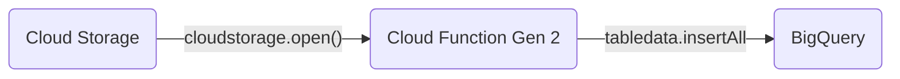

# TL;DR

A simple Google Cloud Function _(Gen 2)_ that reads Json files from Google Cloud Storage and streams documents into BigQuery.



This function is designed to monitor a single cloud bucket using [eventarc](https://cloud.google.com/blog/products/serverless/cloud-functions-2nd-generation-now-generally-available). The specific bucket is defined in the yaml deployment file and the [--trigger-bucket](https://cloud.google.com/sdk/gcloud/reference/functions/deploy#--trigger-bucket) parameter as shown below:

```shell
gcloud  functions deploy my_function --region=us-central1 \
    --runtime=python39 --gen2 --entry-point=main \
    --trigger-bucket=cf-json-ingest \
    --source=gs://cf-cloud-function-source/src.zip
```

I typically use the GitActions and [deploy-cloud-functions](https://github.com/google-github-actions/deploy-cloud-functions) for function deployment; however, this action currently does not support Gen 2 (per this _[Issue](https://github.com/google-github-actions/deploy-cloud-functions/issues/304))_. for this reason I opted to use [gcloud functions deploy](https://cloud.google.com/sdk/gcloud/reference/functions/deploy).

### This source code uses the following API for reading from GCS and writing to BigQuery:

- [cloudstorage.open()](https://cloud.google.com/appengine/docs/legacy/standard/python/googlecloudstorageclient/functions#open)
- [tabledata.insertAll](https://cloud.google.com/bigquery/docs/reference/rest/v2/tabledata/insertAll)

# Setup

This example expects a destination table in BigQuery with the following schema:

```json
[
  {
    "mode": "NULLABLE",
    "name": "name",
    "type": "STRING"
  },
  {
    "mode": "NULLABLE",
    "name": "id",
    "type": "STRING"
  },
  {
    "mode": "NULLABLE",
    "name": "time",
    "type": "STRING"
  }
]
```

The source files are expected to arrive as Json files. An example package is shown below:

```json
{ "name": "chas", "id": "2", "time": "2023-08-16 19:13:00.000" }
```

This project includes a yaml file for deployment to Google Cloud using Github Actions maintained here: https://github.com/google-github-actions/deploy-cloud-functions. The Github Action Workflow requires several _"Action Secrets"_ used to set environment variables during deployment. Set the following secrets in the repository before deployment.

| Action Secret | Value                                                          |
| ------------- | -------------------------------------------------------------- |
| GCP_SA_KEY    | Service Account Key used to authenticate GitHub to GCP Project |
