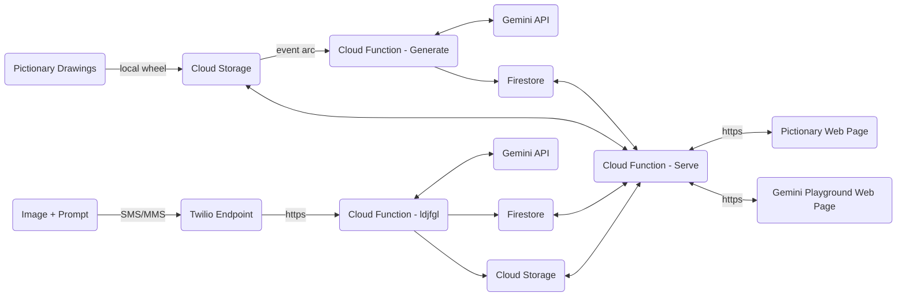

# TL;DR

A simple Python application that highlights the multi-modal capabilities Gemini.

The services outlined this repo are accessed via two HTML pages stored in Cloud Storage. These web pages expose two fun _"carnival game"_ style demos.

1. **Pictionary:** A unique and digital version of the classic game. In this demo, hand drawn images are sent to Gemini and a response is returned to the web page. The response is Gemini's best guess at what the drawing depicts.

   The following prompt is send to gemini with the draing:

   ````txt
   Let's play pictionary. I will show you a drawing I drew and you guess what it is! I will be drawing common nouns like animals, vehicles, and household objects. Please guess even if you are unsure. Do not respond with a question.```

   ````

2. **Gemini Playground:** This open playground allows users to interface with Gemini by texting a picture and prompt to a [Twilio](https://www.twilio.com/en-us?utm_source=google&utm_medium=cpc&utm_term=twilio&utm_campaign=G_S_NAMER_Brand_ROW_RLSA&cq_plac=&cq_net=g&cq_pos=&cq_med=&cq_plt=gp&gad_source=1&gclid=CjwKCAiA0PuuBhBsEiwAS7fsNUuJMS_6sqqcNp5ySf6tFLCHV5sycOoTbtqKN7AuYm1JcUARy4ITtRoCOz8QAvD_BwE) endpoint. The responses are shown on the web page.

# Architecture

Four Cloud Functions _(Gen2)_ power the Pictionary and Gemini Playground demo. The basic architecture is shown in the diagram below. Notice how both Pictionary and the Gemini Playground user interface retreive results from the _Serve_ Cloud Function via webhook.

The `flag` attribute determines what data is served _(Pictionary or Gemini Playgound)_. In the example below, `flag = "text"` indicating the Gemini Playground webpage is calling the function.

## Example Request

The curl command below shows an example http request directed at the _Serve_ Cloud Function. This function returns new results for display.

```curl
curl --location 'https://us-central1-cf-data-analytics.cloudfunctions.net/gemini-example-serve' \
--header 'Content-Type: application/json' \
--data '{
    "flag": "text"
}'
```

## Example Response

The document below shows an example response from the _Serve_ Cloud Function. In this example `flag = ""`, indicating the Pictionary webpage is calling the function. Notice how `imageDescription` contains the Gemini response and the `imageUrl` contains the Cloud Storage location for image sent to Gemini.

```json
{
  "data": [
    {
      "imageDescription": " It's a car!",
      "imageUrl": "https://storage.googleapis.com/cf-gemini-demo-images/b596b155-e06a-4c08-967a-bbe0c0f6fb35.jpg",
      "timeStamp": "2024-02-08T01:06:10.064Z"
    },
    {
      "imageDescription": " A Ferris wheel.",
      "imageUrl": "https://storage.googleapis.com/cf-gemini-demo-images/1eb26cd1-ab19-4c35-92c0-26a4a7e1bc78.jpg",
      "timeStamp": "2024-02-08T01:04:06.291Z"
    },
    {
      "imageDescription": " A pumpkin.",
      "imageUrl": "https://storage.googleapis.com/cf-gemini-demo-images/b50af592-c3c7-47a3-a0fc-3b8101485b9f.jpg",
      "timeStamp": "2024-02-08T01:02:27.463Z"
    }
  ]
}
```

## Architectural Diagram



# Deployment

This project includes a yaml file `.github/workflows/deploy.yaml` for deployment to Google Cloud using Github Actions. The Github Action Workflow requires several _"Action Secrets"_ and _"Action Variables"_ used to authenticate with GCP and set environment variables. Set the following items in the repository before deployment.

## Action Secrets

| Action Secret | Value                                                          |
| ------------- | -------------------------------------------------------------- |
| GCP_SA_KEY    | Service Account Key used to authenticate GitHub to GCP Project |
| HMAC          | Salt key to mask sender identity                               |

## Action Varables

| Action Secret       | Value                                                         |
| ------------------- | ------------------------------------------------------------- |
| GENERATE_SOURCE_GCS | GCS bucket to store the _Generate_ cloud function source code |
| HOST                | GCS bucket to store html                                      |
| IMAGES_GCS          | GCS bucket to store pictionary drawings identity              |
| LOCATION            | GCP destination region                                        |
| SERVE_SOURCE_GCS    | GCS bucket to store the _Serve_ cloud function source code    |
| TWILIO_IMAGES       | GCS bucket to store MMS images from Twilio                    |
| TWILIO_SOURCE_GCS   | GCS bucket to store the _Twilio_ cloud function source code   |

## Gemini Playground _(Twilio)_ Setup

An active Twilio account is required to use the Gemini Playground. Twilio us used to securely receive MMS images and text prompts. These messages are then forwarded to the _Twilio_ Cloud Function via webhook.

Under `Phone Numbers` >> `Active Numbers` >> `Configure` >> `Messaging Configuration` set the `URL` to the _Twilio_ Cloud Function endpoint.

## Pictionary Setup

The Pictionary demo accepts images in the the _IMAGES_GCS_ gcs bucket defined in Action Variables. You can use many different methods to stream images to this bucket. For this example I used some basic Python code shown below:

```python
import cv2
from google.cloud import storage
import uuid
import os


def capture(vid_obj, file_name):
    # Create a VideoCapture object
    # cap = cv2.VideoCapture(0)

    # Check if the camera opened successfully
    if not vid_obj.isOpened():
        print("Could not open camera")
        exit()

    # Loop until the user presses the Esc key
    while True:
        # Capture a frame from the camera
        ret, frame = vid_obj.read()

        # Check if the frame was captured successfully
        if not ret:
            print("Could not capture frame")
            break

        # Display the frame
        cv2.imshow("Frame", frame)

        if cv2.waitKey(1) & 0xFF == ord('c'):

            # Using cv2.flip() method
            image = cv2.flip(frame, 0)

            image = cv2.flip(image, 1)

            cv2.imwrite(file_name, image)
            break

    # # Release the camera
    # cap.release()

    # # Close all windows
    # cv2.destroyAllWindows()


def upload_blob(bucket_name, source_file_name, destination_blob_name):
    """Uploads a file to the bucket."""
    storage_client = storage.Client()
    bucket = storage_client.bucket(bucket_name)
    blob = bucket.blob(destination_blob_name)

    generation_match_precondition = 0

    blob.upload_from_filename(
        source_file_name, if_generation_match=generation_match_precondition)

    print(
        f"File {source_file_name} uploaded to {destination_blob_name}."
    )

bucket_name = "cf-gemini-demo-images"

myuuid = uuid.uuid4()
source_file_name = str(myuuid) + ".jpg"
destination_blob_name = str(myuuid) + ".jpg"


cap = cv2.VideoCapture(0)


while True:
    myuuid = uuid.uuid4()
    source_file_name = str(myuuid) + ".jpg"
    destination_blob_name = str(myuuid) + ".jpg"

    capture(cap, source_file_name)
    upload_blob(bucket_name, source_file_name, destination_blob_name)
    # remove source file
    os.remove(source_file_name)

```
