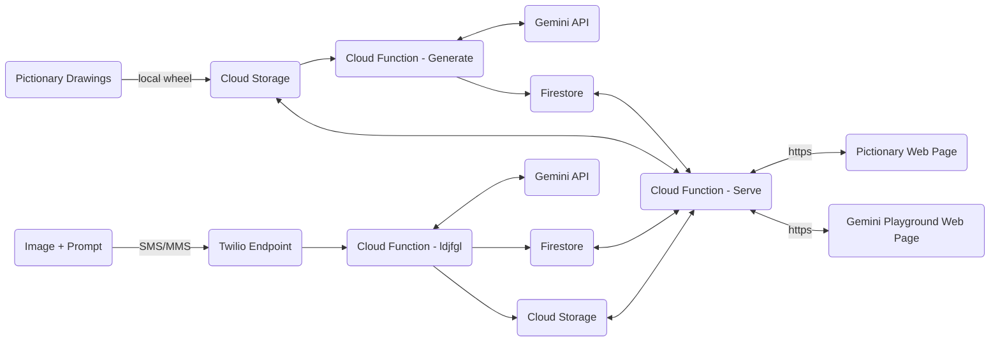

# TL;DR

A simple Python application that highlights the multi-modal capabilities Gemini.

The services outlined this repo are accessed via two HTML pages stored in Cloud Storage. These web pages expose two fun demos.

1. **Pictionary:** A unique and digital version of the classic game. In this demo, hand drawn images are sent to Gemini and a response is returned to the web page. The response is Gemini's best guess at what the drawing depicts.

   The following prompt is send to gemini with the draing:

   `Let's play pictionary. I will show you a drawing I drew and you guess what it is! I will be drawing common nouns like animals, vehicles, and household objects. Please guess even if you are unsure. Do not respond with a question.`

2. **Gemini Playground:** This open playground allows users to interface with Gemini by texting a picture and prompt to a [Twilio](https://www.twilio.com/en-us?utm_source=google&utm_medium=cpc&utm_term=twilio&utm_campaign=G_S_NAMER_Brand_ROW_RLSA&cq_plac=&cq_net=g&cq_pos=&cq_med=&cq_plt=gp&gad_source=1&gclid=CjwKCAiA0PuuBhBsEiwAS7fsNUuJMS_6sqqcNp5ySf6tFLCHV5sycOoTbtqKN7AuYm1JcUARy4ITtRoCOz8QAvD_BwE) endpoint. The responses are shown on the web page.

# Architecture

Four Cloud Functions power the Pictionary and Gemini Playground demo. The basic architecture is shown below. Notice how both end the Pictionary and Gemini Playground user interface interface with the _Cloud Function - Serve_ via webhook.

The flag attribute determines which webpage data is served. In the example below the flag == "text" indicating the the Gemini Playground webpage is calling the function.

## Example Request

```curl
curl --location 'https://us-central1-cf-data-analytics.cloudfunctions.net/gemini-example-serve' \
--header 'Content-Type: application/json' \
--data '{
    "flag": "text"
}'
```

## Example Response

```json
{
  "data": [
    {
      "imageDescription": " It's a car!",
      "imageUrl": "https://storage.googleapis.com/cf-gemini-demo-images/b596b155-e06a-4c08-967a-bbe0c0f6fb35.jpg",
      "timeStamp": "2024-02-08T01:06:10.064Z"
    },
    {
      "imageDescription": " A Ferris wheel.",
      "imageUrl": "https://storage.googleapis.com/cf-gemini-demo-images/1eb26cd1-ab19-4c35-92c0-26a4a7e1bc78.jpg",
      "timeStamp": "2024-02-08T01:04:06.291Z"
    },
    {
      "imageDescription": " A pumpkin.",
      "imageUrl": "https://storage.googleapis.com/cf-gemini-demo-images/b50af592-c3c7-47a3-a0fc-3b8101485b9f.jpg",
      "timeStamp": "2024-02-08T01:02:27.463Z"
    }
  ]
}
```

## Architectural Diagram



# Deployment

This project includes a yaml file for deployment to Google Cloud using Github Actions maintained here: https://github.com/google-github-actions/deploy-cloud-functions. The Github Action Workflow requires several _"Action Secrets"_ used to set environment variables during deployment. Set the following secrets in the repository before deployment.

| Action Secret | Value                                                          |
| ------------- | -------------------------------------------------------------- |
| GCP_SA_KEY    | Service Account Key used to authenticate GitHub to GCP Project |
